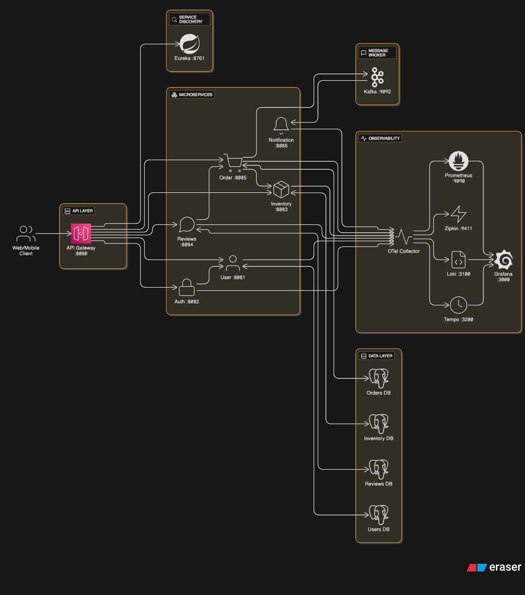

# MicroMart

A microservice architecture on Spring Boot for managing products, orders, inventory, and reviews.

## Arhitecture



## Services

- API Gateway — entry point that routes client traffic to downstream services.
- Eureka — service registry and discovery.
- User Service — user account management.
- Auth Service — authentication and token issuance.
- Inventory Service — stock levels and reservations.
- Order Service — order creation and processing.
- Reviews Service — product ratings and user feedback.
- Notification Service — user notifications.

## Tech Stack

- Java 17
- Spring Boot
- Maven
- PostgreSQL

## Architecture

- Microservices
- API Gateway pattern: a single edge endpoint for all clients
- Service registration and discovery with Netflix Eureka

## Security

- JWT-based authentication and authorization

## Testing

- JUnit, Mockito
- Unit and integration tests
- Testcontainers for isolated environments

## CI/CD

- Maven builds
- Docker containerization
- GitHub Actions for automated build, test, and Docker Hub publishing

## Event-Driven Messaging

- Kafka for inter-service event streaming

## Observability

- Grafana for dashboards
- OpenTelemetry for metrics, traces, and logs
- Grafana Loki for centralized logs
- Grafana Tempo and Zipkin for distributed tracing
- Prometheus for metrics collection

---

## Getting Started

### Option 1: Quick start with prebuilt images (Docker Compose)

Fastest way to run everything using published Docker images.

1) Clone the repo or download the compose file:
   https://github.com/tishembitov/micromart/raw/main/deployment/docker-compose.yaml
2) Run the following command:
```bash
cd deployment && docker-compose up -d
```

### Option 2: Local development (build images from sources)

Build images from your local codebase—slower, but development-friendly.

1) Clone the repository.
2) Launch with rebuild:
```bash
docker-compose -f docker-compose-dev.yaml up -d --build
```

For a smoother workflow, install Java 17+ and Maven. You can spin up core infrastructure (DB, broker, etc.) with:
https://github.com/tishembitov/micromart/raw/main/deployment/docker-compose-infra.yaml

Then run individual services locally:
```bash
mvn spring-boot:run
```

---

## Explore the API

- Swagger UI: http://localhost:8080/swagger
- Postman collection: https://github.com/tishembitov/micromart/raw/main/docs/postman.json
